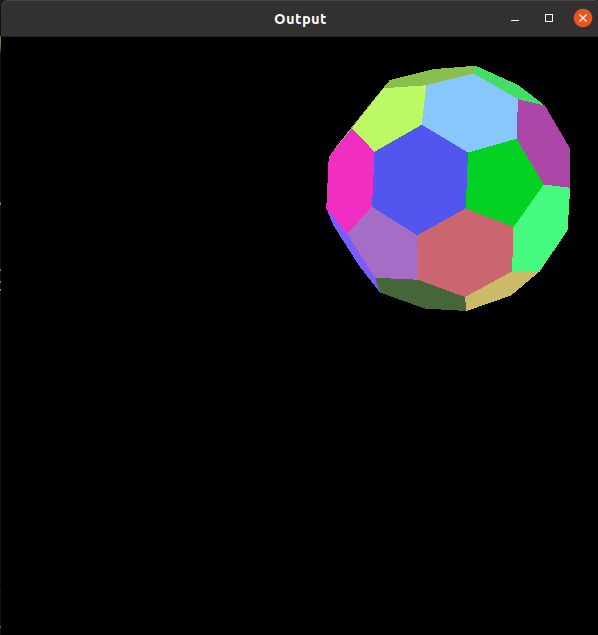
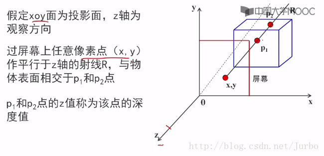
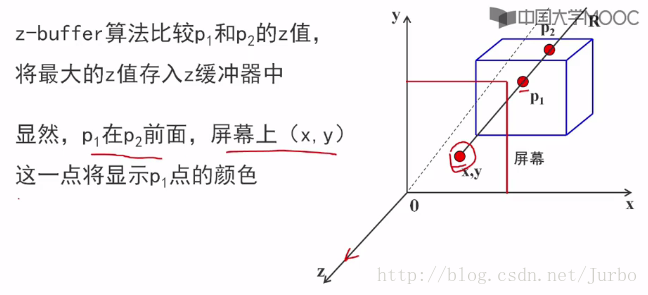

# Z-Buffer 算法

代码来自：https://github.com/praveen1496/Z-Buffer

实现 z-buffer 算法，其中每个多边形应该有不同的常量着色。

### INPUT: 
a) 来自指定文件的多边形对象的几何数据 

b) 查看参数


### OUTPUT:
移除隐藏表面的几个对象的彩色视图。



## 原理：
在绘制时消除被遮挡的不可见的线或面，习惯上称作消除隐藏线和隐藏面，简称为消隐。

要绘制出意义明确地、富有真实感的立体图形，首先必须消去形体中不可见的部分，而只在图形中表现可见部分。

图像空间的消隐算法：以屏幕窗口内的每个像素作为处理单元。确定在每一个像素处，场景中的 k 个物体哪一个距离观察到最近，从而用它的颜色来显示该像素。（这类算法是消隐算法的主流，因为物体空间的消隐算法计算量太大）。

### 经典的Z-buffee算法定义

Z 缓冲区 算法也叫做深度缓冲器算法，属于图像空间消隐算法。

该算法有帧缓冲器和深度缓冲器。对应两个数组：

- intensity( x , y ) ：属性数组（帧缓冲器）；存储图像空间中每个可见像素的颜色值或亮度
- depth( x , y )：深度数组（z-buffer）：存放图像空间每个可见像素的 z 坐标（z坐标即像素的深度值）





### 经典的Z-buffer算法思想

先将 Z 缓冲器中各单元的初始置设置为最小值。当要改变某个像素的颜色值时，首先检查当前多边形的深度值是否大于该像素原来的深度值（保存在该像素所对应的Z 缓冲器的单元中）。如果大于原来的 Z 值，说明当前多边形更靠近观察点，用它的颜色替换像素原来的颜色。

伪代码描述：
```
  Z-Buffer 算法()
  {
      帧缓存全部置为背景色
      深度缓存全部置为最小的Z值
      for(每一个多边形)
      {
          扫描转换该多边形
          for(该多边形在该像素的深度值Z(x,y))
          {
              计算该多边形在该像素的深度值Z(x,y)
              if( z(x,y) > z缓存在(x,y)的值 )
              {
                  把z（x,y）存入 z缓存中(x,y)处
                  把多边形在(x,y)处的颜色值存入帧缓存的(x,y)处
              }
          }
      }
  }

```